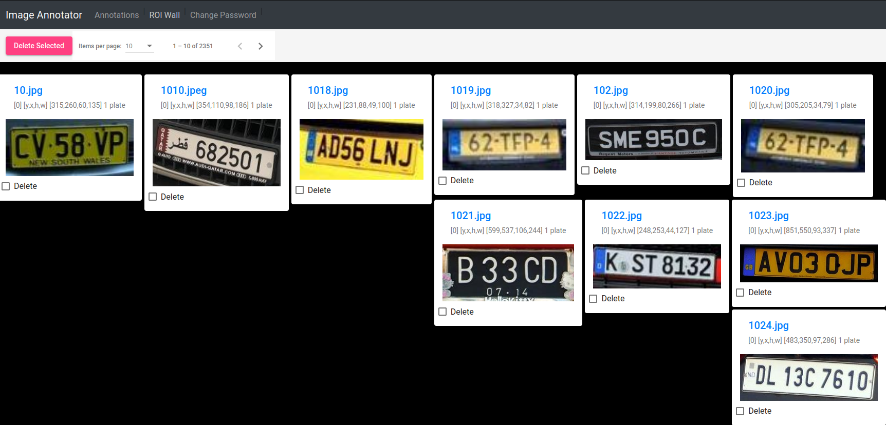

# open-lpr-dataset-plate-detection
Annotated images of license plates to be used with training models.

This repository is part of the [OpenLPR project](https://github.com/faisalthaheem/open-lpr).

The images and associated annotations can be viewed via the [Simanno tool](https://github.com/faisalthaheem/simanno) with the following configuration file. Assuming you're in a directory with write permissions and having this repository checked out to $HOME/work/repos/open-lpr-dataset-plate-detection the following commands will launch simanno with the dataset contained in this repository loaded and ready for use.

```bash
mkdir ./conf-plate-detection && \
cat <<EOT >> ./conf-plate-detection/imanno.yaml
auth:
  path: ./default.creds
  key: IVV7RrKK7fNi1vMHTuJ8aBDFRa2WrqlOqZzvX5w4Nso=
labels:
  list:
    1: plate
  default: 1
anno:
  dbs: /dbs/train.db
  rawimgs: /imgs/train
  refimgs: /imgs/train
  createIfAbsent: True
EOT
```

```bash
cat <<EOT >> docker-compose.yaml
version: "3"

services:
  ws:
    image: faisalthaheem/simanno-be:main
    volumes:
     - $PWD/conf-plate-detection:/simanno/be/conf
     - $HOME/work/repos/open-lpr-dataset-plate-detection/train:/imgs/train
     - $HOME/work/repos/open-lpr-dataset-plate-detection:/dbs
    ports:
      - "5000:5000"

  web:
    image: faisalthaheem/simanno-fe:main
    ports:
      - "8181:80"
EOT
```

```bash
docker-compose up -d
```

> Pay attention to the paths above, if they do not match then simanno will not be able to serve files. In case of any problems consider reviewing docker logs by running docker-compose logs -f


simanno should be available at http://localhost:8181 and should look like the following if ROI Wall page is accessed

